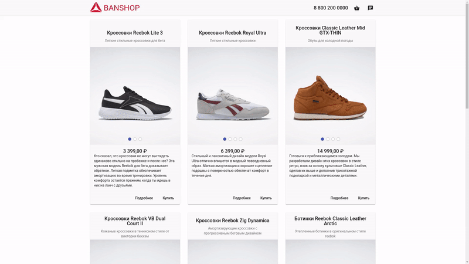
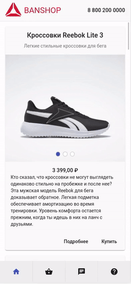

# Banshop

Репозиторий для цикла статей - «Сайт визитка на Angular»

Демо - [banshop.fafn.ru](https://banshop.fafn.ru/)

В статьях будет представлен процесс разработки приложения, который будет начинаться с определения предметной области и заканчиваться тестированием приложения.

Приложение будет разработано на 3 платформы

- handset
- tablet
- web

## Процесс разработки

В первой статье вкратце описан процесс создания нового Angular приложения.

Вторая статья посвящена описанию "core" модулям, которые будут использоваться в библиотеке.

Третья статья расскажет о принципах создания UI KIT общих компонентов, которые будут использоваться в приложении. Примеры компонент из ui-kit: сетка, контейнер, карусель, базовый лейаут приложения, а также еще несколько директив для задания стилей компонентам.

Четвертая статья посвящена разработке модуля продуктов. В статье будет описан процесс создания state, загрузки данных из внешнего источника (google sheets), а также созданы компоненты для отображения полученного списка товаров.

В пятой статье показана реализация модуля корзины. В статье также приведена реализация state корзины, в частности сохранение выбранных товаров, их отображение и изменение.

Шастая статья реализовывает страницу оформления заказа, которая содержит форму с данными о клиенте, а также списком выбранных товаров.

Седьмая статья реализует чат службы поддержки, но без реальной интеграции с внешним провайдером, так как это выходит за рамки статьи.

Восьмая статья посвящена созданию страниц ошибок, а также настройке и генерации локализации.

Девятая статья посвящена настройке локализации в Angular приложении.

Десятая статья посвящена базовой SEO настройки приложения, которая добавляет карту сайта, мета теги и robots.

Одиннадцатая статья направлена на обзор реализации Server Side Rendiring'а с помощью NodeJS, частности express. В статье будет приведена реализация сервера вместе с корректными настройками prerender'а.

Двенадцатая статья посвящена тестированию приложения.

В последней статье произведен обзор проделанной работы, в котором будут ссылки на исходники и демо приложение.

## Ссылки

В данный цикл войдут следующие статьи, которые будут посвящены следующим модулям:

0. [Введение](https://medium.com/fafnur/%D1%81%D0%B0%D0%B9%D1%82-%D0%B2%D0%B8%D0%B7%D0%B8%D1%82%D0%BA%D0%B0-%D0%BD%D0%B0-angular-%D0%B2%D0%B2%D0%B5%D0%B4%D0%B5%D0%BD%D0%B8%D0%B5-9bc18c25fe37)
1. [Создание приложения](https://medium.com/fafnur/%D1%81%D0%B0%D0%B9%D1%82-%D0%B2%D0%B8%D0%B7%D0%B8%D1%82%D0%BA%D0%B0-%D0%BD%D0%B0-angular-%D1%81%D0%BE%D0%B7%D0%B4%D0%B0%D0%BD%D0%B8%D0%B5-angular-%D0%BF%D1%80%D0%B8%D0%BB%D0%BE%D0%B6%D0%B5%D0%BD%D0%B8%D1%8F-a113021c70d3).
2. [Создание core библиотек](https://medium.com/fafnur/%D1%81%D0%B0%D0%B9%D1%82-%D0%B2%D0%B8%D0%B7%D0%B8%D1%82%D0%BA%D0%B0-%D0%BD%D0%B0-angular-%D1%81%D0%BE%D0%B7%D0%B4%D0%B0%D0%BD%D0%B8%D0%B5-core-%D0%B1%D0%B8%D0%B1%D0%BB%D0%B8%D0%BE%D1%82%D0%B5%D0%BA-8fbe0a7f9608)
3. [Создание UI KIT](https://medium.com/fafnur/%D1%81%D0%B0%D0%B9%D1%82-%D0%B2%D0%B8%D0%B7%D0%B8%D1%82%D0%BA%D0%B0-%D0%BD%D0%B0-angular-%D1%81%D0%BE%D0%B7%D0%B4%D0%B0%D0%BD%D0%B8%D0%B5-ui-kit-75c02751900e)
4. [Реализация модуля товаров](https://medium.com/fafnur/%D1%81%D0%B0%D0%B9%D1%82-%D0%B2%D0%B8%D0%B7%D0%B8%D1%82%D0%BA%D0%B0-%D0%BD%D0%B0-angular-%D0%BC%D0%BE%D0%B4%D1%83%D0%BB%D1%8C-%D1%82%D0%BE%D0%B2%D0%B0%D1%80%D0%BE%D0%B2-659cd5599e93)
5. [Реализация модуля корзины](https://medium.com/fafnur/%D1%81%D0%B0%D0%B9%D1%82-%D0%B2%D0%B8%D0%B7%D0%B8%D1%82%D0%BA%D0%B0-%D0%BD%D0%B0-angular-%D0%BC%D0%BE%D0%B4%D1%83%D0%BB%D1%8C-%D0%BA%D0%BE%D1%80%D0%B7%D0%B8%D0%BD%D1%8B-1644d9cc493d)
6. [Реализация модуля заказа](https://medium.com/fafnur/%D1%81%D0%B0%D0%B9%D1%82-%D0%B2%D0%B8%D0%B7%D0%B8%D1%82%D0%BA%D0%B0-%D0%BD%D0%B0-angular-%D0%BC%D0%BE%D0%B4%D1%83%D0%BB%D1%8C-%D0%BE%D1%84%D0%BE%D1%80%D0%BC%D0%BB%D0%B5%D0%BD%D0%B8%D1%8F-%D0%B7%D0%B0%D0%BA%D0%B0%D0%B7%D0%B0-f2f0051ab82)
7. [Реализация модуля чата](https://medium.com/fafnur/%D1%81%D0%B0%D0%B9%D1%82-%D0%B2%D0%B8%D0%B7%D0%B8%D1%82%D0%BA%D0%B0-%D0%BD%D0%B0-angular-%D0%BC%D0%BE%D0%B4%D1%83%D0%BB%D1%8C-%D1%87%D0%B0%D1%82%D0%B0-e0fad0d09778)
8. [Страницы ошибок](https://medium.com/fafnur/%D1%81%D0%B0%D0%B9%D1%82-%D0%B2%D0%B8%D0%B7%D0%B8%D1%82%D0%BA%D0%B0-%D0%BD%D0%B0-angular-%D1%81%D1%82%D1%80%D0%B0%D0%BD%D0%B8%D1%86%D1%8B-%D0%BE%D1%88%D0%B8%D0%B1%D0%BE%D0%BA-cc71d573f7ca)
9. [Локализация](https://medium.com/fafnur/%D1%81%D0%B0%D0%B9%D1%82-%D0%B2%D0%B8%D0%B7%D0%B8%D1%82%D0%BA%D0%B0-%D0%BD%D0%B0-angular-%D0%BD%D0%B0%D1%81%D1%82%D1%80%D0%BE%D0%B9%D0%BA%D0%B0-%D0%BB%D0%BE%D0%BA%D0%B0%D0%BB%D0%B8%D0%B7%D0%B0%D1%86%D0%B8%D0%B8-4eb6ce8b2aac)
10. [Настройка SEO](https://medium.com/fafnur/%D1%81%D0%B0%D0%B9%D1%82-%D0%B2%D0%B8%D0%B7%D0%B8%D1%82%D0%BA%D0%B0-%D0%BD%D0%B0-angular-%D0%BD%D0%B0%D1%81%D1%82%D1%80%D0%BE%D0%B9%D0%BA%D0%B0-seo-69d1a329cd41)
11. [Настройка SSR](https://medium.com/fafnur/%D1%81%D0%B0%D0%B9%D1%82-%D0%B2%D0%B8%D0%B7%D0%B8%D1%82%D0%BA%D0%B0-%D0%BD%D0%B0-angular-%D0%BD%D0%B0%D1%81%D1%82%D1%80%D0%BE%D0%B9%D0%BA%D0%B0-ssr-e7d61b03c24e)
12. [Тестирование](https://medium.com/fafnur/%D1%81%D0%B0%D0%B9%D1%82-%D0%B2%D0%B8%D0%B7%D0%B8%D1%82%D0%BA%D0%B0-%D0%BD%D0%B0-angular-unit-%D1%82%D0%B5%D1%81%D1%82%D0%B8%D1%80%D0%BE%D0%B2%D0%B0%D0%BD%D0%B8%D0%B5-801760969790)
13. [Заключение](https://medium.com/fafnur/%D1%81%D0%B0%D0%B9%D1%82-%D0%B2%D0%B8%D0%B7%D0%B8%D1%82%D0%BA%D0%B0-%D0%BD%D0%B0-angular-%D0%B7%D0%B0%D0%BA%D0%BB%D1%8E%D1%87%D0%B5%D0%BD%D0%B8%D0%B5-1c5b9dec26fc)
